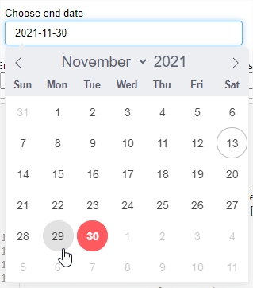
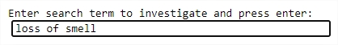
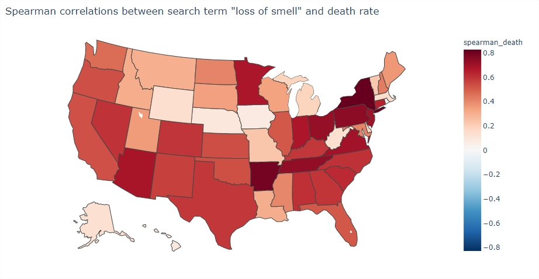
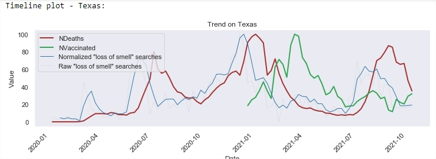
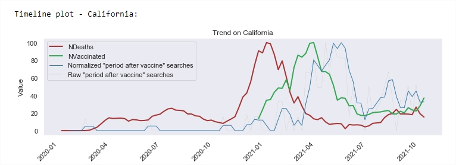

# CovidTrends
CovidTrends is a small tool i've created to inspect correlations between Google trends data and Covid-19 data in U.S, hopefully to support and inspire further research

# HowTo
Simply run the notebook, you will be prompted to choose dates:

And also choose a search term:

Then you will be able to inspect the results. e.g:

## Credits

* [PyTrends](https://pypi.org/project/pytrends/)
* [Google Trends](https://trends.google.com/)
* [Covid-19-data](https://github.com/owid/covid-19-data)
* [CSSEGISandData](https://github.com/CSSEGISandData/COVID-19)

## Contributing

Contributions to the project are welcome, if you have a neat idea feel free to ping me!
